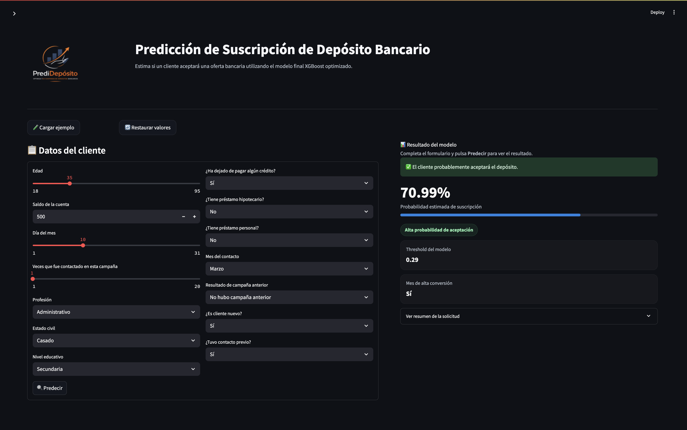

# 🏦 PrediDepósito — Customer Subscription Prediction
> Predicción inteligente de clientes con mayor probabilidad de contratar depósitos

<div align="center">


</div>

---

## Resumen del proyecto

Los bancos suelen realizar **campañas de marketing telefónico a gran escala** para promocionar productos financieros como los **depósitos a plazo**.
Sin embargo, contactar a los clientes de forma aleatoria conlleva:

- Altos costes operativos
- Bajas tasas de conversión
- Mala experiencia del cliente

Este proyecto crea un **modelo de clasificación de aprendizaje automático** capaz de predecir qué clientes tienen mayor probabilidad de suscribirse a un depósito a plazo.

Al priorizar a los clientes con alta probabilidad de suscripción, los equipos de marketing pueden:

- 📈 aumentar la conversión de la campaña
- 📉 reducir los costes operativos
- 🎯 centrarse en los clientes potenciales más prometedores

------------------------------------------------------------------------

## Objetivos del proyecto

El objetivo de este proyecto fue desarrollar un **sistema predictivo de clientes** que:

- identifique a los clientes con **alta probabilidad de suscripción**
- respalde la toma de decisiones de marketing basadas en datos**
- pueda implementarse en una **aplicación interactiva Streamlit**

---

## Lo que construimos

Un pipeline de Machine Learning de extremo a extremo, desde los datos crudos hasta una aplicación interactiva lista para usar:

```
Datos UCI  →  EDA  →  Preprocesamiento  →  SMOTE  →  Entrenamiento  →  Tuning  →  App Streamlit
```

El modelo final es un **XGBoost optimizado con Optuna** que alcanza un **AUC-ROC de 0.792** operando únicamente con información disponible *antes* del contacto — sin atajos, sin data leakage, listo para producción.

**PrediDepósito** = es una aplicación Streamlit que permite a cualquier miembro del equipo de marketing introducir el perfil de un cliente y obtener su score de propensión en tiempo real, sin necesidad de conocimientos técnicos.



---

## Tecnologías

| Categoría | Stack |
|-----------|-------|
| Lenguaje | Python 3.12 |
| Gestión de entorno | uv |
| Datos | Pandas · NumPy |
| Visualización | Matplotlib · Seaborn · Plotly |
| Machine Learning | Scikit-learn · XGBoost · Imbalanced-learn |
| Optimización | Optuna |
| Explicabilidad | SHAP |
| Aplicación | Streamlit |
| Testing | Pytest |

---

## Instalación

### Requisitos previos

- Python ≥ 3.10
- [`uv`](https://docs.astral.sh/uv/) — gestor de entornos y dependencias

```bash
# Instalar uv si aún no lo tienes
curl -LsSf https://astral.sh/uv/install.sh | sh
```

### Paso a paso

```bash
# 1. Clonar el repositorio
git clone https://github.com/Bootcamp-IA-P6/Proyecto6_Clasificacion_Equipo2.git
cd Proyecto6_Clasificacion_Equipo2

# 2. Crear el entorno virtual
uv venv
source .venv/bin/activate      # Linux / macOS
# .venv\Scripts\activate       # Windows

# 3. Instalar dependencias
uv sync
```

---

## Uso de la aplicación

Con el entorno activo, lanzar la app es una sola línea:

```bash
streamlit run app/streamlit_app.py
```

Se abrirá automáticamente en `http://localhost:8501`.

Desde la interfaz podrás:
- **Puntuar un cliente** — introduce su perfil y obtén la probabilidad de suscripción al instante
- **Explorar el modelo** — revisa métricas, curvas ROC y matriz de confusión
- **Entender las predicciones** — visualiza qué variables están impulsando cada resultado gracias a SHAP

---

## Ejemplo de ejecución

```bash
# Lanzar la app
streamlit run app/streamlit_app.py

# (Opcional) Ejecutar el pipeline completo desde cero
python main.py

# (Opcional) Pasar los tests
uv run pytest test/
```

---

## Estructura del proyecto

```
Proyecto6_Clasificacion_Equipo2/
│
├── app/
│   └── app.py                    # Aplicación interactiva
│
├── assets/                       # Gráficos y recursos visuales
│
├── data/
│   ├── raw/                      # Dataset original UCI
│   └── processed/                # Datos transformados
│
├── models/                       # Modelos serializados
│
├── notebook/                     # EDA, Pipeline, Modelos
│   
├── reports/                      # Informe técnico del proyecto y dicionario del dataset
│
├── src/
│
├── test/                         # Tests unitarios
├── main.py
├── pyproject.toml
├── uv.lock
└── README.md
```

---

## Autores

Desarrollado por:
- Andrés Torrez
- Iris Amorim
- Mirae Kang
- Maryori Cruz

---

<div align="center">

📄 [Informe Técnico](https://github.com/Bootcamp-IA-P6/Proyecto6_Clasificacion_Equipo2/blob/main/reports/model_report.md) · 📓 [Notebooks](https://github.com/Bootcamp-IA-P6/Proyecto6_Clasificacion_Equipo2/blob/main/notebook/05_modeling_xgboost.ipynb) · 🖥️ [Aplicación](https://github.com/Bootcamp-IA-P6/Proyecto6_Clasificacion_Equipo2/blob/main/app/app.py)

</div>